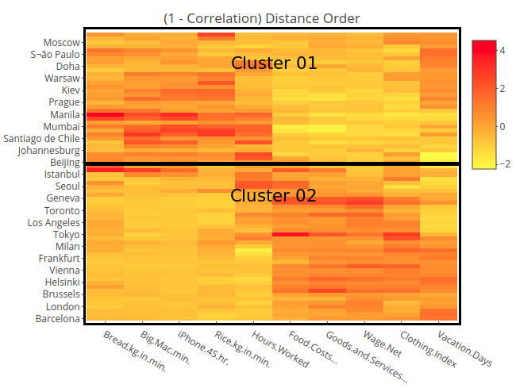
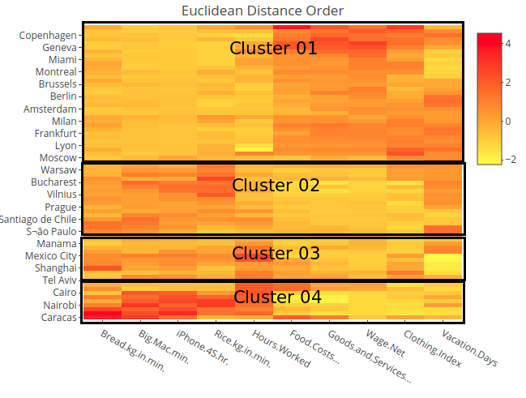
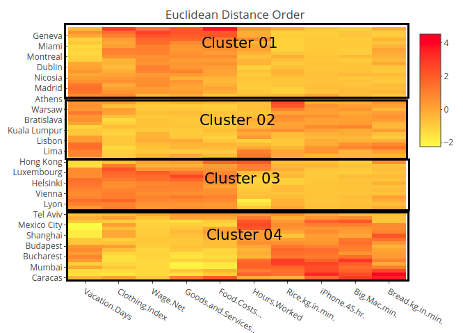
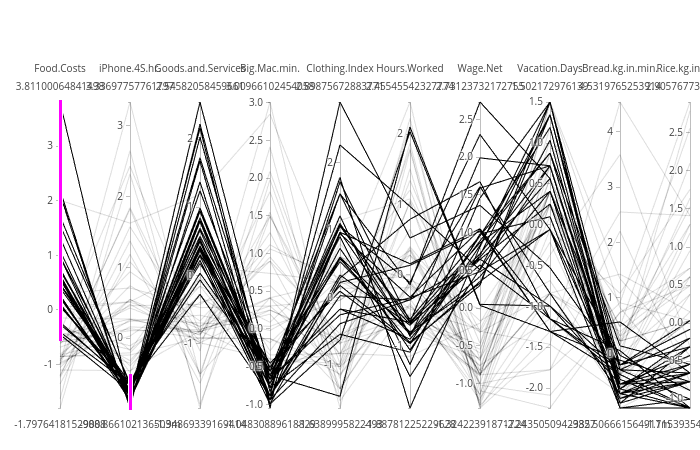
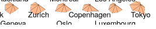

```{r setup, include=FALSE}
knitr::opts_chunk$set(echo = TRUE)
```

***

# Group 17
* Mim Kemal Tekin (mimte666)
* Hector Plata (hecpl268)

***

# Assignment 1

*High-dimensional visualization of economic data*

*File prices-and-earnings.txt shows a UBS’s (one of the largest banks in the world) report comparing prices, wages, and other economic conditions in cities around the world. Some of the variables measured in 73 cities are Cost of Living, Food Costs, Average Hourly Wage, average number of Working Hours per Year, average number of Vacation Days, hours of work (at the average wage) needed to buy an iPhone, minutes of work needed to buy a Big Mac, and Women’s Clothing Cost.*

## Task 1.1

*For further analysis, import data to R and keep only the columns with the following numbers: 1,2,5,6,7,9,10,16,17,18,19. Use the first column as labels in further analysis.*


```{r}
# Task 1.1
# Reading in the data file.
df = read.csv("prices-and-earnings.csv")

# Storing the columns we want to keep.
columns = c(1,2,5,6,7,9,10,16,17,18,19)

# Slicing the data frame.
df = df[, columns]

# Storing the cities as row names
# and deleting the column.
row.names(df) = df$City
df = df[, 2:dim(df)[2]]
print(head(df))
```

## Task 1.2

*Plot a heatmap of the data without doing any reordering. Is it possible to see clusters, outliers?*

It's really hard to find any clusters on the heatmap. It looks more like white noise.
```{r message=FALSE, warning=FALSE}
# Task 1.2
library(plotly)

df_scaled = scale(df)

plot_ly(x=colnames(df_scaled),
        y=rownames(df_scaled), 
        z=df_scaled,
        type="heatmap",
        colors=colorRamp(c("yellow", "red")))
```

## Task 1.3

*Compute distance matrices by a) using Euclidian distance and b) as one minus correlation. For both cases, compute orders that optimize Hamiltonian Path Length and use Hierarchical Clustering (HC) as the optimization algorithm. Plot two respective heatmaps and state which plot seems to be easier to analyse and why. Make a detailed analysis of the plot based on Euclidian distance.*


```{r message=FALSE, warning=FALSE}
# Task 1.3
library(seriation)

# Computing distance matrices.
set.seed(4)
df_dist_euclid_row = dist(df_scaled, method="euclidean")
df_dist_euclid_col = dist(t(df_scaled), method="euclidean")
df_dist_corr_row = as.dist(1 - cor(t(df_scaled)))  # Converting it into a distance matrix.
df_dist_corr_col = as.dist(1 - cor(df_scaled))  # Converting it into a distance matrix.

# Calculating the order.
order_euclid_row = seriate(df_dist_euclid_row, "GW")
order_euclid_col = seriate(df_dist_euclid_col, "GW")
order_cor_row = seriate(df_dist_corr_row, "GW")
order_cor_col = seriate(df_dist_corr_col, "GW")

# Saving the GW data for euclid
# for the next question.
ordered_euclid_GW = order_euclid_row

# Extracting the order.
ord_euclid_row = get_order(order_euclid_row)
ord_euclid_col = get_order(order_euclid_col)
ord_cor_row = get_order(order_cor_row)
ord_cor_col = get_order(order_cor_col)

# Ordering the data.
df_euclid_ord = df_scaled[rev(ord_euclid_row), ord_euclid_col]
df_cor_ord = df_scaled[rev(ord_cor_row), ord_cor_col]

# Saving for the task 1.6
df_euclid_HC = df_euclid_ord

# Plotting heatmap.
plot_ly(x=colnames(df_euclid_ord),
        y=rownames(df_euclid_ord), 
        z=df_euclid_ord,
        type="heatmap",
        colors=colorRamp(c("yellow", "red"))) %>%
  layout(title="Euclidean Distance Order")

plot_ly(x=colnames(df_cor_ord),
        y=rownames(df_cor_ord), 
        z=df_cor_ord,
        type="heatmap",
        colors=colorRamp(c("yellow", "red"))) %>%
  layout(title="(1 - Correlation) Distance Order")
```

The heatmat that uses the euclidean distance as a metric for the distance matrix, seems the easier to analyse. In both plots clusters can be seen, however, for the the one that uses the correlation as a distance matrix seems like some observations could be paired together. For example, in the second plot, the rows corresponding to `Manila`, `Caracas`, `Jakarta`, `Bogota` and others, could be grouped together due to their high values corresponding to the first 5 variables. This gives the impression that under the 1 - correlation metric there are just two big clusters.



While in the case of the euclidean distance, it's possible to see at least 4 clusters. These clusters are more well defined and less mixed up like the ones seen on the correlation distance matrix heatmap. The euclidean distance it's the distance between two vectors. This concept translates easier to a graphic perspective since it's easier to digest distances between color scales than the correlation between them.



Finally, it's notable from the euclidean distance order heatmap, that the cities are ordered from cities well known for having a great quality of life and being stable and it transitions to cities in which the quality of life is poor and unstable (from top to bottom). This is easily seen if we observe the change in colour of the variables. The first 4 variables on the X axis of the heatmap represents the proportion of the minimum wage that correspond to some goods values(`bread`, `Big Mac`, `iPhone 4S` and `rice`). These goods, could be seen as basic ones since tree out of four are related to food that everyone else should be able to get and the fourth one being a smarthphone. It's now possible to see that the lower we get on the Y axis, the greater these values become. Meaning that the minimum wage on these cities doesn't cover as much of the basic needs as the wages of the cities up top on the plot. The quality of life also can bet measured by the number of hours worked and the vacation days the workers have access to. In this case there is an inverse correlation between these two variables. The number of hours worked increses from top to bottom and the vacation days decreases on the same direction. Again, this highlights the fact that the cities are ordered by quality of life. The remaining of the variables are related to the net prices of goods. It's well known that these kind of goods (`clothing` and `food`) are more costly in first world countries than on the others. This fact can be seen as well on the heatmap. There is one notable outlier which is `Caracas`, where not only the basic goods are more expensive relative to it's minimum wage, but also it's food and services. 

## Task 1.4

*Compute a permutation that optimizes Hamiltonian Path Length but uses Traveling Salesman Problem (TSP) as solver. Compare the heatmap given by this reordering with the heatmap produced by the HC solver in the previous step – which one seems to be better? Compare also objective function values such as Hamiltonian Path length and Gradient measure achieved by row permutations of TSP and HC solvers (Hint: use criterion() function)*


```{r kable, message=FALSE, warning=FALSE}
# Task 1.4
library(knitr)
# Calculating the order.
set.seed(4)
order_euclid_row = seriate(df_dist_euclid_row, "TSP")
order_euclid_col = seriate(df_dist_euclid_col, "TSP")

# Saving for the criterion 
# part of this question.
ordered_euclid_TSP = order_euclid_row

# Extracting the order.
ord_euclid_row = get_order(order_euclid_row)
ord_euclid_col = get_order(order_euclid_col)

# Ordering the data.
df_euclid_ord = df_scaled[rev(ord_euclid_row), ord_euclid_col]

# Plotting heatmap.
plot_ly(x=colnames(df_euclid_ord),
        y=rownames(df_euclid_ord), 
        z=df_euclid_ord,
        type="heatmap",
        colors=colorRamp(c("yellow", "red"))) %>%
  layout(title="Euclidean Distance Order")


# Comparing objective functions for 
# different solvers.
unordered = criterion(df_dist_euclid_row,
                      method=c("Path_length",
                               "Gradient_raw"))
HC = criterion(df_dist_euclid_row,
               ordered_euclid_GW,
               method=c("Path_length",
                        "Gradient_raw"))
TSP = criterion(df_dist_euclid_row,
                ordered_euclid_TSP,
                method=c("Path_length",
                         "Gradient_raw"))

data = list(unordered=unordered, HC=HC, TSP=TSP)
data = as.data.frame(data)
row.names(data) = c("Hamiltonian Path Length",
                    "Gradient Measure")
kable(data)
```

Using the traveling salesman problem also gives the impression of 4 clusters. However the natural descending order from cities that belong to first world countries to cities that belong to third world countries is lost in the process. This makes the analysis of the heatmap a little bit harder, since this kind of pattern is lost.

Regarding the objective functions, the TSP solver was the best at minimizing the `Path Length` (loss function) while the HC performed better at maximizing the `Gradient Measure` (merit function). This result doesn't translate directly into which solver is best for creating cluster and the interpretability of the heatmaps given the mixed results since each performed better on different functions.




## Task 1.5

*Use Ploty to create parallel coordinate plots from unsorted data and try to permute the variables in the plot manually to achieve a better clustering picture. After you are ready with this, brush clusters by different colors and comment about the properties of the clusters: which variables are important to define these clusters and what values of these variables are specific to each cluster. Can these clusters be interpreted? Find the most prominent outlier and interpret it.*

The order of the variables is as follows:
`Food.Costs` - > `iPhone.4S` -> `Goods.and.Services` -> `Big.Mac.min` -> `Clothing.index` -> `Hours.Worked` -> `Wage.Net` -> `Vacation.Days` -> `Bread.kg.in.min` -> `Rice.kg.in.min`

With this ordering of variables, there seems to be two clusters on the parallel coordinate plots. The variable that separates these two clusters is `Food.Costs`. This variable is used to color the lines. The separtion is made between cities which have a bigger food cost (scaled) than -0.5. This separation behaves well for the first 5 variables, however the clusters dissapear afterwards.

This cluster can be interpreted in the sense that it separates cities by how expensive it's food is. This separation can be seen on the euclidean distance heatmap as well as the one that uses 1 - correlation for it's distnace matrix. It's visible on these plots, that you can group most of the cities into two clusters just by the `Food.Costs` variable. Usually cities which are more developed are going to have expensier food than those who aren't.

In this case, the most prominent outlier is the line that spawns out of `Food.Costs` with a value of almost 2. This observation corresponds to the city of `Caracas`. This city is the capital of Venezuela. A country which has been on an ongoing crisis for several years and that has suffered from hyperinflation, incrementing the costs of living generally and the cost of imported goods. This is why it has a weird behaviour on the parallel coordinate plot as well as on the heatmap plots.

```{r message=FALSE, warning=FALSE}
df_scaled["Caracas", ]
```



```{r message=FALSE, warning=FALSE}
# Task 1.5

df_scaled = as.data.frame(df_scaled)
df_scaled$color = as.numeric(df_scaled$Food.Costs... > -0.5)

p = df_scaled %>%
  plot_ly(type = 'parcoords', 
          dimensions = list(
            list(label="Food.Costs", values=~Food.Costs...),
            list(label="iPhone.4S.hr.", values=~iPhone.4S.hr.),
            list(label="Goods.and.Services", values=~Goods.and.Services...),
            list(label="Big.Mac.min.", values=~Big.Mac.min.),
            list(label="Clothing.Index", values=~Clothing.Index),
            list(label="Hours.Worked", values=~Hours.Worked),
            list(label="Wage.Net", values=~Wage.Net),
            list(label="Vacation.Days", values=~Vacation.Days),
            list(label="Bread.kg.in.min.", values=~Bread.kg.in.min.),
            list(label="Rice.kg.in.min.", values=~Rice.kg.in.min.)
          )
        )

p


#Plotly - can not see observation ID
p = df_scaled %>%
  plot_ly(type = 'parcoords', 
          line = list(color =~color),
          dimensions = list(
            list(label="Food.Costs", values=~Food.Costs...),
            list(label="iPhone.4S.hr.", values=~iPhone.4S.hr.),
            list(label="Goods.and.Services", values=~Goods.and.Services...),
            list(label="Big.Mac.min.", values=~Big.Mac.min.),
            list(label="Clothing.Index", values=~Clothing.Index),
            list(label="Hours.Worked", values=~Hours.Worked),
            list(label="Wage.Net", values=~Wage.Net),
            list(label="Vacation.Days", values=~Vacation.Days),
            list(label="Bread.kg.in.min.", values=~Bread.kg.in.min.),
            list(label="Rice.kg.in.min.", values=~Rice.kg.in.min.)
          )
        )

p
```

## Task 1.6

*Use the data obtained by using the HC solver and create a radar chart diagram with juxtaposed radars. Identify two smaller clusters in your data (choose yourself which ones) and the most distinct outlier.*


```{r}
# Task 1.6
stars(df_euclid_HC,
      draw.segments=F,
      col.stars=rep("#ffbb87",
                    nrow(df_euclid_HC)))
```

Below is presented the first cluster found. The outlier for this cluster is Cairo, it can be seen that it's shape on it's top part is pretty different to the others.


Here is the second small cluster found. In this case the outlier is Tokyo since it has more prominent values on top on the radar plot.



## Task 1.7

*Which of the tools you have used in this assignment (heatmaps, parallel coordinates or radar charts) was best in analyzing these data? From which perspective? (e.g. efficiency, simplicity, etc.)*

The best graphical tool for analyzing this data set was the heatmaps. It was simple to extract information about the clusters and get insights about the structure of the data just by the color palette presented (in the case of the ordered heatmaps). It's easy to see that it will be a good tool for data with a lot more entries (features / variables) than the data set used for this assigment. It is also easy to see how cluttered methods like parallel coordinates and radar charts can get when the data (number of rows and number of colomns) goes beyond the current data set, making the analysis of the data harder on. If we were for example analysing every city in the world. Most surely the parallel coordinates plot and the radar chart would be filled with so much entries that it would have make it difficult to interpret any information given by this data set.


# Assignment 2


## Task 2.1


*Use ggplot2 to make a scatter plot of Hours per Week versus age where observations are colored by Income level. Why it is problematic to analyze this plot? Make a trellis plot of the same kind where you condition on Income Level. What new conclusions can you make here?*

```{r message=FALSE, warning=FALSE}
library(ggplot2)

# load data
df = read.csv(file="adult.csv", sep=",", header = FALSE)
#change colnames
colnames(df) = c(
  "age",
  "workclass",
  "fnlwgt",
  "education",
  "education-num",
  "marital-status",
  "occupation",
  "relationship",
  "race",
  "sex",
  "capital-gain",
  "capital-loss",
  "hours-per-week",
  "native-country",
  "income-level"
)

## TASK 2.1
# age vs hours-per-week colored by income-level
t_2_1_a = ggplot(df, aes(
  x = `hours-per-week`,
  y = age,
  color = `income-level`
)) +
  geom_point()


t_2_1_a

# age vs hours-per-week facet by income-level
t_2_1_b = ggplot(df, aes(y=age, x=`hours-per-week`)) + 
  geom_point() + 
  geom_smooth() +
  facet_wrap(facets = ~`income-level`)
t_2_1_b
```

In the graph which is colored by income level, it is really difficult to analyse data separately because of the overlaps in different colors. 
Additionally in the same plot, we cannot see the high density that we can see in trellis plot between 30-50 hours-per-week and 25-60 age.
As we can see richer people do not work as much as the poor people.
Elder people that are rich works on avarage more than elder people that are poor.
Younger rich people does not work as much as the poor ones. 
Poor people work more at part time jobs (0-40 hours per week) in all ages.  
Really old people (>75) work less if their income is higher than 50k.

## Task 2.2
*Use ggplot2 to create a density plot of age grouped by the Income level. Create a trellis plot of the same kind where you condition on Marital Status. Analyze these two plots and make conclusions.*

```{r message=FALSE, warning=FALSE}
## TASK 2.2
# bonus: calculate mean
means = df %>%
  group_by(`income-level`) %>%
  summarise(m = mean(age))
# density plot of age grouped by the Income level
t_2_2_a = ggplot(df, aes(x=age, fill=`income-level`)) +
  geom_density(alpha=0.4) +
  geom_vline(data=means, aes(xintercept=m, color=`income-level`),
             linetype="dashed")
# add the mean lines
t_2_2_a = t_2_2_a +
  geom_vline(data=means, aes(xintercept=m, color=`income-level`),
             linetype="dashed")

# bonus: calculate mean
means = df %>%
  group_by(`income-level`, `marital-status`) %>%
  summarise(m = mean(age))
# trellis plot condition on Marital Status , density plot of age grouped by the Income level
t_2_2_b = ggplot(df, aes(x=age, fill=`income-level`)) +
  geom_density(alpha=0.4) +
  facet_wrap(facets = ~`marital-status`)
# add the mean lines
t_2_2_b = t_2_2_b + geom_vline(data=means, aes(xintercept=m, color=`income-level`),
                     linetype="dashed")

t_2_2_a
t_2_2_b
```

Rich people are older than poor people. Also we can see that there is more variance in poor people.
As we see from divorced people, married-civ-spouse, separated, widowed graphs have the almost same distribution of the age by income level.  
Low level income people who are never married tend to be young which is expected, because people who have low level income are usually younger and they don't tend to be married early in life.
Married-af people that are elder tend to have low level income than the younger ones. In the same graph we can see that younger or elder people do not have much difference between incomes.  
It is more likely for people spouses to be absent in their 50s, if you have high income.


## Task 2.3
*Filter out all observations having Capital loss equal to zero. For the remaining data, use Plotly to create a 3D-scatter plot of Education-num vs Age vs Captial Loss. Why is it difficult to analyze this plot? Create a trellis plot with 6 panels in ggplot2 in which each panel shows a raster-type 2d-density plot of Capital Loss versus Education-num conditioned on values of Age (use cut_number() ) . Analyze this plot.*

```{r message=FALSE, warning=FALSE}
## TASK 2.3

# filter out capital loss equal zero
n_df = df[df[,"capital-loss"]!=0,]

# x axis title
axx = list(
  title = 'Ordered Education Num'
)

# y axis title
axy = list(
  title = 'Age'
)

# z axis title
axz = list(
  title = 'Capital Loss'
)
# 3D-scatter plot of Education-num vs Age vs Captial Loss 
t_2_3_a = plot_ly(n_df, x = ~`education-num`, y = ~`age`, z = ~`capital-loss`, size=0.5) %>%
  add_markers() %>%
  layout(scene = list(xaxis = axx,
                      yaxis = axy,
                      zaxis = axz))

cut_n_df = n_df
cut_n_df$age_bins = cut_number(n_df$age, 6)

t_2_3_b = ggplot(cut_n_df, aes(x = `capital-loss`, y = `education-num`)) +
  stat_density_2d(aes(fill = ..density..), geom = "raster", contour = FALSE) +
  facet_wrap(facets = ~age_bins) +
  scale_fill_distiller(palette= "Spectral", direction=1) 

t_2_3_a
t_2_3_b
```

The `Ordered Education Num` variable is not continuos, which makes harder to analyse the graph, because its clusters the observations into it's levels.

People in 35,41 and 41,46 are more educated than the other ones. Young people in 17-29 are not educated which is expected since they are just starting their education.
Most of the age groups have the same capital loss except the younger ones. Probabily because younger people doesnt have access to capital markets (loans).  
Also we can see the elder people in 54,90 dont have good education because the education system probably was worse than what it is for younger generations.

## Task 2.4
*Make a trellis plot containing 4 panels where each panel should show a scatter plot of Capital Loss versus Education-num conditioned on the values of Age by a) using cut_number() b) using Shingles with 10% overlap. Which advantages and disadvantages you see in using Shingles?*

```{r message=FALSE, warning=FALSE}
cut_n_df = n_df
cut_n_df$age_cut = cut_number(n_df$age, 4)

Agerange = lattice::equal.count(n_df$age, 4, overlap=0.1)
L<-matrix(unlist(levels(Agerange)), ncol=2, byrow = T)
L1<-data.frame(Lower=L[,1],Upper=L[,2], Interval=factor(1:nrow(L)))
index=c()
Class=c()
for(i in 1:nrow(L)){
  Cl=paste("[", L1$Lower[i], ",", L1$Upper[i], "]", sep="")
  ind=which(cut_n_df$age>=L1$Lower[i] &cut_n_df$age<=L1$Upper[i])
  index=c(index,ind)
  Class=c(Class, rep(Cl, length(ind)))
}
df_shingle = cut_n_df[index,]
df_shingle$Class = as.factor(Class)

t_2_4_a = ggplot(cut_n_df, aes(x = `capital-loss`, y = `education-num`)) +
  geom_point() +
  facet_wrap(facets = ~age_cut)

t_2_4_b = ggplot(df_shingle, aes(x = `capital-loss`, y = `education-num`))+ 
  geom_point()+
  facet_wrap(~Class, labeller = "label_both")

t_2_4_a
t_2_4_b
```

We can see more smooth transition between bins of age that are divided by shingles. What we mean by this, is that shingles is a way of transforming a categorical variable to a "continious" one. That is the advantage of using shingles. The main disadvantage / advantage of using shingles depends on the data. Shingles can create/destroy some patterns which are not visible otherwise. For example in the 4th bin without shingles, it is visible that the points are more concentrated while in the one with shingles, the data seems more spread out.

# Appendix
```{r, ref.label=knitr::all_labels(), echo=TRUE, eval=FALSE}
```