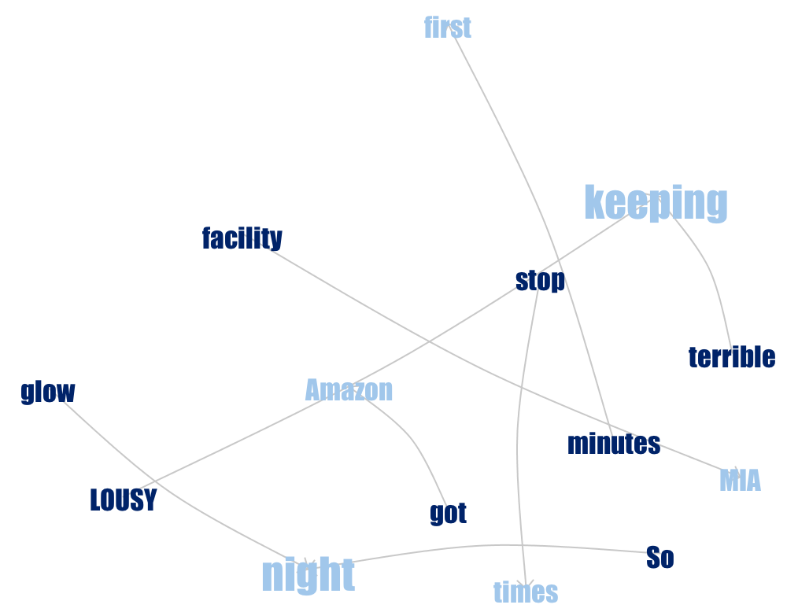

```{r setup, include=FALSE}
knitr::opts_chunk$set(echo = TRUE)
```


***

# Group 17
* Mim Kemal Tekin (mimte666)
* Hector Plata (hecpl268)

***

# Assignment 01
In this assignment you will analyze feedbacks given by customers for watches Casio AMW320R-1EV bought at www.amazon.com . Files Five.txt and OneTwo.txt contain feedbacks of the customers who were pleased and not pleased with their buy, respectively.

## Task 1.1
*Use R tools to create a word cloud corresponding to Five.txt and OneTwo.txt and adjust the colors in the way you like. Analyze the graphs.*

```{r warnings=FALSE, message=FALSE}
library("tm")
library("wordcloud")
library("RColorBrewer")

# Read the text file
filePath_five = "Five.txt"
filePath_onetwo = "oneTwo.txt"

text_five = readLines(filePath_five)
text_five = text_five[-88]    # eliminating spanish data.
text_onetwo = readLines(filePath_onetwo)

# Remove empty lines
text_five = text_five[-which(text_five == "")]
text_onetwo = text_onetwo[-which(text_onetwo == "")]

# Make all words to lower case
text_five = lapply(text_five, FUN=tolower)
text_onetwo = lapply(text_onetwo, FUN=tolower)

# set ids
# transform it as a data frame for text_five
data_five = data.frame(text=unlist(text_five), stringsAsFactors = FALSE)
data_five$doc_id = 1:nrow(data_five)
colnames(data_five)[1] = "text"
# transform it as a data frame for text_onetwo
data_onetwo = data.frame(text=unlist(text_onetwo), stringsAsFactors = FALSE)
data_onetwo$doc_id = 1:nrow(data_onetwo)
colnames(data_onetwo)[1] = "text"

# Create corpus
corpus_five = Corpus(DataframeSource(data_five)) 
corpus_onetwo = Corpus(DataframeSource(data_onetwo)) 

# Remove punctuations
corpus_five = tm_map(corpus_five, removePunctuation)
corpus_onetwo = tm_map(corpus_onetwo, removePunctuation)

# Remove stopwords
corpus_five = tm_map(corpus_five, function(x) removeWords(x, stopwords("english")))
corpus_onetwo = tm_map(corpus_onetwo, function(x) removeWords(x, stopwords("english")))

# Create term doc matrix
tdm_five = TermDocumentMatrix(corpus_five) 
tdm_onetwo = TermDocumentMatrix(corpus_onetwo) 
m_five = as.matrix(tdm_five)
m_onetwo = as.matrix(tdm_onetwo)

# calculate freqs
v_five = sort(rowSums(m_five),decreasing=TRUE) 
v_onetwo = sort(rowSums(m_onetwo),decreasing=TRUE) 

# create dataframe from the freqs and colnames
d_five <- data.frame(word = names(v_five),freq=v_five) 
d_onetwo <- data.frame(word = names(v_onetwo),freq=v_onetwo) 

# create color palette
pal <- brewer.pal(6,"Dark2")
pal <- pal[-(1:2)] #Create palette of colors
```
### Five Star Comments
```{r warnings=FALSE, message=FALSE}
# wordcloud for five stars
wordcloud(d_five$word, d_five$freq, 
          scale=c(8,.3),
          min.freq=3,
          max.words=90, 
          random.order=F, 
          rot.per=.15, 
          colors=pal, 
          vfont=c("sans serif","plain"))
```

In word cloud we can see which word most repeated. In this case it is "watch". So, It can be sait the paper about watch which is casio brand. If we can take a look all the words it is clear to see pople mostly talked about great, like, price, band, looks, digital, amazon. Additionally we have all these words used in five star comments. So they means generally good. For example: may be about low price, good band, looks great, etc.

### One-Two Star Comments
```{r warnings=FALSE, message=FALSE}
# wordcloud for one and two stars
wordcloud(d_onetwo$word, d_onetwo$freq, 
          scale=c(8,.3),
          min.freq=3,
          max.words=90, 
          random.order=F, 
          rot.per=.15, 
          colors=pal, 
          vfont=c("sans serif","plain"))


```

In this word cloud, we can easily see this words: watch, battery, replace, like, amazon, casio, one, months, year. As we know these word cloud created with one-two star comments. So we can think they may be negative comments. For example: there may be a problem with battery, one month/year may mean that customers had problem in one month/year after buy the watch.

As we can see, wordmaps helps us to see which words have used in the regarding text. But it is really hard to analyse it, espacially if we do not know the topic. In this examples, we know where the data comes from and we can predict which words can represent what.

## Task 1.2
*Create the phrase nets for Five.Txt and One.Txt with connector words*

- am, is, are, was, were 

**Five.txt**


**OneTwo.txt**


**Analysis**  
As we can se in the **Five.txt** file's phrase net, people that bought this watch are generally happy.  
We can se "I am pleased", "I am glad", "I am happy" phrases.  
Also, people commented a lot about watch. When we check the phrases we can see they talk about "watch is awesome", "watch is unbeatable", "watch is huge".  
We are able to see some compliments such as "it is comfortable", "it is good", "it is great" refers to the watch.  
Additionally people commented "price is right" and "price is great".  
Generally, we can understand people are happy. Most of these connections are also related with adjetives, so these stopwords are good for understanding the properties of a product.

In the other figure, we visualize **OneTwo.txt**. In the one two star comments we can see people still say "watch is great" strongly, but in the other hand, it is possible to see some bad comments. For example, "display is useless", "I am sad" and "I am disappointed".


- a, the

**Five.txt**


**OneTwo.txt**


**Analysis**  
In this plots, we used "a" and "the" as a connector. Phrase network of **Five.txt**, we can see the strongest relations between use-digital and change-battery. There is another thing that we can see about watch, the relation between worth-money. There are people mention about replacing the band again.

In network of the **OneTwo.txt** file, the strongest relation is replace-battery. We can predict from here, people who are not satisfied about watch, has replaced battery of the watch. The other word has highest frequency is "like". We can think people complain about its design, strap and some people may think it looks like old.


- at

**Five.txt**


**OneTwo.txt**




**Analysis**  
In the **Five.txt**, we can see the words have highest frequency are watch, one, Costco and night. "night" word connected with viewable and readable. People may comment good things about night view of the watch. We can see the relation between watch, costco and waalmart which are electronics stores. We can think from this observation, people mention about prices of the watch at different stores.

In the **OneTwo.txt** network, we can see people may complain about it is "terrible" and "lousy" at keeping time. Some people probabily mention about stop at times.

- of


**Analysis**

For the connector word `of` the most used words for the one to two stars review were: couple, pice, months, truckload and years. The word could `of` is connected strongly with months which could mean that hte watch only lasted for a few mounths, meaning that the users got a really bad quality watch. Another curious thing is the relation between piece `of` junk which relates to the statement above. A watch of this kind should last for a long time or at least that's what it's expected about it. Another relationship that shows up that reinforces this idea is the connection seen below to the right between the word truckload and bullsh, which can be considered as bullshit. This means that the customers are really angry about the product that got into their hands. It's really hard to get an idea of the characteristics of the watch that they are angry about.

As for the the users that gave good reviews to this watch, we can see that the word years appears again with service and flying, this could mean that these customer had a really great experience with their watch. They also seem to like the variety of the design they can choose from the amazon web page. There are also some words related with service and replacement, which means that casio in most cases has a good after purchase service for their customers. As for the characteristics that they refer the most, we can see that the conector `of` is used the most with visual features of the watch, like edges, designs, colors, digital features and so on.

## Task 1.3
**NOTE:** The analysis of the phrase networks is done below the corresponding images of the connectors.


- am, is , are, was, were

Here the most cluttered relationship was with watch and the multiple relationships between words. The word tree was so big, the we can only present a fraction of it. We see from the context that as expected most of the customers are happy with the watch as expected by the adjectives found on the word cloud.


- at

In the **Five.txt** phrase word we can see the relation of "one", "watch" with "costco" and "waalmart". We can see the meaning of this relationship in the below. 


**OneTwo.txt** have some relations between "lousy", "terrible" to "keeping". If we investigate this we can reach the result in the below.
`LOUSY at keeping accurate time.`  
and  
`terrible at keeping accurate time. Sometimes it just stops. The second hand just sticks a few times a day. It might go a few days   without loosing time and then it will stop a few times a day.`  
We can say customers do not satisfied about tracking time of watch.

- of

One of the relationship that caught our eyes was between truckload and bullshit. Below is presented a fragment of what the cutomer had to say in his review:

`truckload of bullsh.t, NOT FAIR! They want me to buy a new one from them at 99.95, special price for you, 89.95`

This customer is really angry because casio probably asked him to buy a new watch for a special price when the original failed. This new special price was no special at all for him since they only reduced the value by 10 USD dollars which is not that much for a faulty 100 USD dollars watch.

as for the most prominent word `couple` most of the customers refers to how inaccurate the watch it to keep track of time as it can be seen on the word tree below:


The other relationship that caught our eye was piece `of` junk. We can see that most of the customer are angry because the recieved a faulty unit.


As for the relationship of words for the five star rating we see from the word three that most of the customers are really happy for how long lasting their watches have been. One of the customers even said that he had traveled the whole world with it and it is still working after several years of use and abuse.


It's also possible to see some of the characteristics of this watch are that it's water proof, it has a digital display and a (possible) bad battery. We can also infer that the strip can wear a lot over time. The watch can also track the day and number of month but apparently is unable to do it accurately.


# Assignment 02
In this assignment, you will continue analyzing data **olive.csv** that you started working with in lab 2. These data contain information about contents of olive oils coming form different regions in Italy. Each observation contains information about

- Region (1=North, 2=South, 3=Sardinia island)
- Area (different Italian regions)
Different acids:
- Palmitic
- ...
- Eicosenoic

**ATTN: All diagrams that support your judgements should be included to the report**

In this assignment, you are assumed to use Plotly without Shiny.


## Task 2.1
**Create an interactive scatter plot of the eicosenoic against linoleic. You have probably found a group of observations having unusually low values of eicosenoic. Hover on these observations to find out the exact values of eicosenoic for these observations.**

These low observations have in common that the variable `eicosenoic` has a value lower than 10.

```{r warnings=FALSE, message=FALSE}
# Task 2.1.
# Importing libraries.
library(plotly)
library(crosstalk)

# Loading the data.
df = read.csv("olive.csv")

# Transforming the region into a factor.
df$Region = factor(df$Region)

# Creating a shared data.frame.
df_shared = SharedData$new(df)

# Creating the scatter plot and plotting it.
scatter_olive = plot_ly(df_shared,
                        x=~linoleic,
                        y=~eicosenoic) %>%
  layout(xaxis=list(title="linoleic"),
         yaxis=list(title="eicosenoic"))
scatter_olive

```

## Task 2.2
**Link the scatterplot of (`eicosenoic`, `linoleic`) to a bar chart showing `Region` and a slider that allows to filter the data by the values of stearic. Use persistent brushing to identify the regions that correspond unusually low values of `eicosenoic`. Use the slider and describe what additional relationships in the data can be found by using it. Report which interaction operators were used in this step.**

```{r warnings=FALSE, message=FALSE}
# Task 2.2.
# Creating the bar chart for the region.
bar_olive = plot_ly(df_shared,
                    x=~Region) %>%
  add_histogram() %>%
  layout(barmode="overlay")

# Creating the whole linked plot.
bscols(widths=c(2, NA),
       filter_slider("stearic",
                     "Stearic",
                     df_shared,
                     ~stearic),
       subplot(scatter_olive,
               bar_olive) %>%
       highlight(on="plotly_select",
                 dynamic=TRUE,
                 persistent=TRUE,
                 opacityDim=I(1)) %>%
       hide_legend())

```

Using the persistent brushing tool, it's easy to see that the observations that hold unusually low values of `eicosenoic` only belongs to the `Regions` 2 and 3 (Figure 1).


Also, it's possible to see all observations with a `linoleic` lower than 1000, only belong to regions 1 and 3 (Figure 2). In addition, it's also visible that for high values (from the middle of the range to the highest value) of `stearic` most observations are also contained in these two regions (1 and 3, Figure 3). Finally, the slider also allow us to see that most observations with unusually low values of `eicosenoic` are between a small range value of the `stearifc` variable (Figure 4).

For this plot, the following interaction operators were used:

- Navigation
- Selection
- Connection
- Filtering


## Task 2.3
**Create linked scatter plots `eicosenoic` against `linoleic` and `arachidic` against `linolenic`. Which outliers in (`arachidic`, `linolenic`) are also outliers in (`eicosenoic`, `linoleic`)? Are outliers grouped in some way? Use brushing to demonstrate your findings.**

Most of the outliears on the `arachidic` against `linolenic` plot are contained on the low values of `eicosenoic` as seen in *Figure 5*.

```{r message=FALSE, warnings=FALSE}
# Task 2.3.
# Create the scatter plot of arachidic vs linolenic.
scatter_olive_2 = plot_ly(df_shared,
                          x=~linolenic,
                          y=~arachidic) %>%
    layout(xaxis=list(title="linolenic"),
           yaxis=list(title="arachidic"))

# Creating the whole linked plot.
bscols(widths=c(NA),
       subplot(scatter_olive,
               scatter_olive_2) %>%
       highlight(on="plotly_select",
                 dynamic=TRUE,
                 persistent=TRUE,
                 opacityDim=I(1)) %>%
       hide_legend())

```


## Task 2.4
**Create a parallel coordinate plot for the available eight acids, a linked 3d-scatter plot in which variables are selected by three additional drop boxes and a linked bar chart showing `Regions`. Use persistent brushing to mark each region by a different color. Observe the parallel coordinate plot and state which three variables (let's call them influential variables) seem to be mostly reasonable to pick up if one wants to differentiate between the regions. Does the parallel coordinate plot demonstrate that there are clusters among the observations that belong to the same `Region`? Select the three influential variables in the drop boxes and observe in the 3d-plot whether each `Region` corresponds to one cluster.**

From **Figure 7** can be seen that a decent candidate for these `influential variables` is `oleic` since it's easy to distinguish between the variables. The second best choice would be `linoleic`. However, at this point is really difficult to choose one, since there are no really good candidates. In this case we go with `linolenic` since you can see the colours being separeted a little bit better than on the other variables.

As stated above the parallel coordinate plot shows that there is some separation between variables when we look at the variables `oleic` and `linoleic` but not so much about `linolenic`. It doesn't demonstrate by itself that there are cluster among the observations that beling to the same `Region` however it could be said that it suggests that there is some separation between them.

Looking at the 3D-scatter plot with the selected influential variables and separated by `Regions` it is easy to see that the observations are clustered. There might be some overlap with the first and the third region on their limits, but most of the observations can be separated pretty well by `Region`.


```{r warnings=FALSE, message=FALSE}
# Task 2.4.
library(GGally)

# Setting up the acids.
acids = c("palmitic",
          "palmitoleic",
          "stearic",
          "oleic",
          "linoleic",
          "linolenic",
          "arachidic",
          "eicosenoic")

# Creating a shared data.frame.
df_shared = SharedData$new(df, group="task24")

# Creating the coordinate plot.
coord_olive = ggparcoord(df, columns=4:11)

# Transforming the coordinate plot into plotly.
coord_olive_data = plotly_data(ggplotly(coord_olive)) %>% 
                      group_by(X)

# Creating a new shared object.
df_shared_2 = SharedData$new(coord_olive_data, ~.ID, group="task24")

# Creating the new coordinate plot.
coord_olive_plotly = plot_ly(df_shared_2, x=~variable, y=~value) %>%
                      add_lines(line=list(width=0.3), color=I("#33AAE3")) %>%
                      add_markers(marker=list(size=0.3),
                                  text=~.ID,
                                  hoverinfo="text")


# Creating the linked 3D-scatter plot
# where varibales are selected by 
# 3 drop down menus.

# Creating the 3 drop down
# buttons for (X, Y, Z)
ButtonsX = list()
for (i in 1:8)
  {
    ButtonsX[[i]] = list(method="restyle",
                         args=list("x", list(df[, acids][[i]])),
                         label=colnames(df[, acids])[i])
  }

ButtonsY = list()
for (i in 1:8)
 {
   ButtonsY[[i]] = list(method="restyle",
                        args=list("y", list(df[, acids][[i]])),
                        label=colnames(df[, acids])[i])
 }

ButtonsZ = list()
for (i in 1:8)
  {
     ButtonsZ[[i]] = list(method="restyle",
                          args=list("z", list(df[, acids][[i]])),
                          label=colnames(df[, acids])[i])
  }

scatter_3d_olive = plot_ly(df_shared,
                           x=~palmitic,
                           y=~palmitoleic,
                           z=~stearic,
                           alpha = 0.8) %>%
  add_markers() %>%
  layout(scene=list(xaxis=list(title=""),
                    yaxis=list(title=""),
                    zaxis=list(title="")),
    title = "Select variable:",
    updatemenus = list(list(y=0.9, buttons=ButtonsX),
                       list(y=0.6, buttons=ButtonsY),
                       list(y=0.3, buttons=ButtonsZ)))

# Creating the linked region bar chart.
bar_olive = plot_ly(df_shared,
                    x=~Region) %>%
  add_histogram() %>%
  layout(barmode="overlay")


htmltools::tagList(coord_olive_plotly %>%
                         highlight(on="plotly_select",
                                   off="plotly_deselect",
                                   color=c("#ffbb87",
                                           "#ff8690",
                                           "#87cdff",
                                           "#292929"),
                                   dynamic=T,
                                   persistent=T,
                                   opacityDi =I(1)) %>%
                         hide_legend(),
                   
                   scatter_3d_olive %>%
                     highlight(o ="plotly_select",
                               off="plotly_deselect",
                                   color=c("#ffbb87",
                                           "#ff8690",
                                           "#87cdff",
                                           "#292929"),
                               dynamic=T,
                               persistent=T, 
                               opacityDim=I(1)) %>%
                         hide_legend(),
                   
                   bar_olive %>% 
                      highlight(on="plotly_select",
                                off="plotly_deselect",
                                   color=c("#ffbb87",
                                           "#ff8690",
                                           "#87cdff",
                                           "#292929"),
                                dynamic=T,
                                persistent=T,
                                opacityDim=I(1)) %>%
                         hide_legend())
```


## Task 2.5
**Think about which interaction operators are available in step 4 and what interaction operands they are be applied to. Which additional interaction operators can be added to the visualization in step 4 to make it even more efficient/flexible? Based on the analysis in the previous steps, try to suggest a strategy (or, maybe, several strategies) that would use information about the level of acids to discover which regions different oils comes from.**

In step 4 we have several interaction operators which are:

- **Navigation Operator:** this operator can be seen in the 3D-scatter plot. This interaction operator interacts with the data value space by letting the user zoom in or out of the data.

- **Selection and Connection Operators:** this operators can be see among all of the plots. It manifest itself with the persistent brushing, which can select a group of observation, making them more visible on the other graphs. These operands affect the attribute space by changing the aesthetics of the graph. In this case it changes the colour of certains observations among all other plots (highlighting them with some distinct colour).

- **Reconfiguring operators:** this operator can be seen on the 3D-scatter plot, this operator allows the user to select which variables to select of reach axis. This operator affects the data value space since the user can configure the space of the observation by changing which variables to use to plot the 3D-scatter graph.

Another interactivate operator that can be added to the graph is a filtering operator, this will give the user the freedom of selecting certaing ranges of the data that he wants to explore. This can be helpful since the plot used for the parallalel cordinates doesn't have this option since the default one from plotly is bugged and the GGally one is needed in this case to sufice the constrain of the previous question. The main strategy would be to give the user to filter by all acid levels in questions. Doing this can help clean up the overlaping of the parallel coordinate plots and probably providing a better tool of separating observations in the 3D-scatter plot. For example, the user could filter by the levels of linolenic and only let values that are inferior to 1 to see if there is a better separation between `Regions`.


# Appendix
```{r, ref.label=knitr::all_labels(), echo=TRUE, eval=FALSE}
```