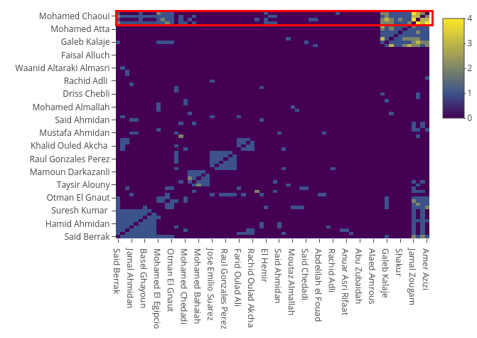
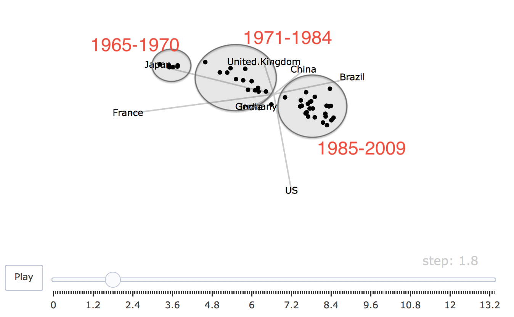

```{r setup, include=FALSE}
knitr::opts_chunk$set(echo = TRUE)
```

***

# Group 17
* Mim Kemal Tekin (mimte666)
* Hector Plata (hecpl268)

***

# Assignment 01. Network visualization of terrorist connections

Files **trainData.dat** and **trainMeta.dat** contain information about a network of the individuals involved in the bombing of commuter trains in Madrid on March 11, 2004. The names included were of those people suspected of having participated and their relatives.

File **trainMeta.dat** contains the names of individuals (first column) and Bombing group (second column) which shows "1" if person participated in placing the explosives and "0" otherwise. According to the order in this file, persons were enumarated 1-70.

File **trainData.dat** contains information about connections between the individuals (first two columns) and strength of ties linking (from one to four):

1. Trust -- friendship (contact, kinship, links in the telephone center).
2. Ties to Al Qaeda and to Osama Bin Laden.
3. Co-participation in training camps and/or wars.
4. Co-participation in previous terrorist Attacks (September 11, Casablanca).

## Task 1.1

*Use visNetwork package to plot the graph in which*

a. *you use strength of links variable.*
b. *nodes are colored by Bombing Group.*
c. *size of nodes is proportional to the number of connections (function strength() from IGRAPH might be useful here).*
d. *you use a layout that optimizes repulsion forces (visPhysics(solver="repulsion")).*
e. *all nodes that are connected to a currently selected node by a path of length one are highlighted.*

*Analyse the obtained network, in particular describe which clusters you see in the network.*

There seems to be a big cluster which are made from the nodes that are connected to the biggest 3 nodes. These 3 nodes corresponds to `Mohamed Chaoui`, `Jamal Zougam` and `Imad Edding Barakat`. There is another cluster that can be conformed by those observations that have no relation with any other node on the graph, like `Sanel Sjekirika` or `Faisal Alluch`. Another cluster is seen by highlighting the nodes with distance 1 from `Ivan Granados`. Another cluster is seen by the nodes highlighted when selecting `Rachid Oulad Akcha` and `Mohamed Bahaiah`. In total there seems to be at most 4 clusters. These clusters doesn't seem so separated, since it seems like every node can be reached by 2 levels of separation.

```{r warnings=FALSE, message=FALSE}
# Importing the libraries.
library(visNetwork)
library(plyr)
library(igraph)

# Setting the seed.
set.seed(4)

# Loading the data.
edges = read.table("trainData.dat")  # Links of the graph.
nodes = read.table("trainMeta.dat")  # Nodes of the graph.

# Preprocessing.
# Creating the ids for the nodes.
nodes$id = c(1:dim(nodes)[1])

# Renaming the columns for visNetwork.
colnames(nodes) = c("label", "group", "id")
colnames(edges) = c("from", "to", "value")

# Setting the size of each node by the number of connections.
counts = count(edges$from)
nodes$value = 0
nodes[nodes$id %in% counts$x, ]$value = counts$freq
nodes = nodes[, c("id", "label", "group", "value")]

# Creating undirected graph.
net = graph_from_data_frame(d=edges, vertices=nodes, directed=F)

# Plotting the network.
#visNetwork(nodes, edges) %>% 
visIgraph(net, idToLabel=FALSE, randomSeed=4) %>% 
 visPhysics(solver="repulsion") %>% 
 visLegend(main="Bombing group") %>% 
 visOptions(highlightNearest=TRUE)
```

## Task 1.2

*Add a functionality to the plot in step 1 that highlights all nodes that are connected to the selected node by a path of length one or two. Check some amount of the largest nodes and comment which individual has the best opportunity to spread the information in the network. Read some information about this person in Google and present your findings.*

`Abdeluahid Berrak` seems to be the individual with the best opportunity to spread information across the network. He can reach $75.71\%$ of the network with a degree of 2. According to Google `Abdeluahid Berrak` was charged for collaborating with a terrorist organization. Theres no more information about the subject. However as seen in the network he has ties with everyone up to some degree, which makes sense that he in someway was working with the terrorist organization, especially since this individual knows most of all the people who participated on the bombing.

```{r warnings=FALSE, message=FALSE}
visIgraph(net, idToLabel=FALSE, randomSeed=4) %>%  
 visPhysics(solver="repulsion") %>% 
 visLegend(main="Bombing group") %>% 
 visOptions(highlightNearest=list(enabled=TRUE,  # Added the functionality
                                  degree=2))     # to highlight nodes of
                                                 # degree 2.
```

## Task 1.3

*Compute clusters by optimizing edge betweenness and visualize the resulting network. Comment whether the clusters you identified manually in step 1 were also discovered by this clustering method.*

As for the "cluster" made up of nodes with no connection to the graph, they are still there. However this is no surprise at all. As for the big cluster mentioned above that was all the nodes that were connected to: `Mohamed Chaoui`, `Jamal Zougam` and `Imad Edding Barakat` was divided into two smaller (but still big) clusters. What's interesteing is that these three persons are clustered together when optimizing by edge betweenness. The cluster made by `Ivan Granados` is present in this graph, with the difference that has a few more connections. Finally the cluster made by `Rachid Oulad Akcha` and `Mohamed Bahaiah` was merged together with one of the smaller (but still big) clusters of the nodes with a lot of connections mentioned in the first task. In addition, a new cluster appears. This one is generated when highlightining `Mamoun Darkazanli`.

In conclusion, the clusters defined in step one were discovered by the graph in some proportion. It also generates new ones and split another. The result of this new grouping is somewhat interesting and satisfactory since the clusters generated makes sense when comparing it to the original graph created in the task 1.1.

```{r warnings=FALSE, message=FALSE}
# Creating the clusters.
nodes_alt = nodes[, c("id", "label", "group", "value")]  # Changing columns to fit the igraph specification.
net = graph_from_data_frame(d=edges, vertices=nodes_alt, directed=FALSE)
ceb = cluster_edge_betweenness(net)
nodes_alt$group = ceb$membership

# Plotting the graph.
visNetwork(nodes_alt, edges) %>%
  visIgraphLayout() %>% 
  visOptions(highlightNearest=TRUE) %>% 
  visPhysics(solver="repulsion")
```


## Task 1.4

*Use adjacency matrix representation to perform a permutation by Hierachical Clustering (HC) seriation method and visualize the graph as a heatmap. Find the most pronounced cluster and comment whether this cluster was discovered in steps 1 or 3.*

The most prominent cluster is shown on the `Figure 1` and a zoomed version is shown on the `Figure 2`. This cluster was discovered on both steps 1 and 3 as mentioned on the tasks before, there is a strong relation between the following individuals `Mohamed Chaoui`, `Jamal Zougam` and `Imad Edding Barakat` which re appears again.

```{r warnings=FALSE, message=FALSE}
# Importing the library.
library(seriation)
library(plotly)

# Getting the adjacency matrix.
adj_m = get.adjacency(net, attr="value", sparse=F)

# Change column and row names of the adjacency matrix.
colnames(adj_m) = V(net)$label  # nodes$label also works.
rownames(adj_m) = V(net)$label  # nodes$label also works.

# Calculating the distance matrix.
row_dist = dist(adj_m)

# Getting the ordered indexes.
ordered_indxs = get_order(seriate(row_dist, "HC"))

# Ordering the adjacency matrix.
ordered_adj_m = adj_m[ordered_indxs, ordered_indxs]

# Removing encoding issues.
# Observation 22 has an escape character.
rownames(ordered_adj_m)[22] = "Jose Emilio Suarez"
colnames(ordered_adj_m)[22] = "Jose Emilio Suarez"

# Observation 58 has an escape character.
rownames(ordered_adj_m)[58] = "Alaed Amrous"
colnames(ordered_adj_m)[58] = "Alaed Amrous"

# Creating and plotting the heatmap.
plot_ly(z=ordered_adj_m,
        x=colnames(ordered_adj_m),
        y=rownames(ordered_adj_m),
        type="heatmap")
```



# Assignment 2: Animations of time series data

## Task 2.1

*Visualize data in Plotly as an animated bubble chart of Coal versus Oil in which the bubble size corresponds to the country size. List several noteworthy features of the investigated animation.*

```{r warnings=FALSE, message=FALSE, warning=F}
library(plotly)
### TASK 2.1

# read data
df_oilcoal = read.csv("Oilcoal.csv", sep=";", dec = ',', header = T)

p_t_2_1 = df_oilcoal %>%
  plot_ly(
    x = ~Coal,
    y = ~Oil,
    frame = ~Year,
    size = ~Marker.size,
    # marker = list(size = ~Size, opacity = 0.5),
    text = ~Country, 
    hoverinfo = "text",
    type = 'scatter',
    mode = 'markers'
  ) %>%
  layout(showlegend = FALSE) %>%
  add_markers(color=~Country)
p_t_2_1
```

Oil consumption in every country increase until 1973. Between 1974 - 1975 all countries live the first global decrease. With a quick research, we can see in October 1973, Organization of Arab Petroleum Exporting Countries declared an oil embargo which was end in March 1974. This embargo is aimed to US, UK and Japan. We can see their decrease. Also this embargo called as ["first oil shock"](https://en.wikipedia.org/wiki/1973_oil_crisis#International_relations).  
After this crisis, Countries increased oil consumption until 1979. In 1979, ["second oil crisis"](https://en.wikipedia.org/wiki/1979_oil_crisis) started. The reason was decreased oil outputs as a result of Iranian Revolution. There was only 4% decrease, but it created a global crisis. After this period of 1 year, countries focused to produce and export their oil.  
Additionally, until the end of the 1980, the nearly constant (except China) consumption of coal started to increase. China has a regular increase in coal until 2002. After 2002, China has consumption of coal more than doubled until 2009.

## Task 2.2

*Find two countries that had similar motion patterns and create a motion chart including these countries only. Try to find historical facts that could explain some of the sudden changes in the animation behavior. *


```{r warnings=FALSE, message=FALSE, warning=F}
p_t_2_2 = df_oilcoal %>%
  filter(Country == c("Germany", "France")) %>%
  plot_ly(
    x = ~Coal,
    y = ~Oil,
    frame = ~Year,
    # marker = list(size = ~Marker.size, opacity = 0.5),
    text = ~Country,
    hoverinfo = "text",
    type = 'scatter',
    mode = 'markers',
    size = ~Marker.size
  ) %>%
  layout(showlegend = FALSE) %>%
  add_markers(color=~Country)
p_t_2_2
```

Germany and France have quite similar motions for oil consumption in the chart. Because they had the same reactions during the oil crisis.  
In the end the two countries decreased their coal consumption to nearly half. But when we see the value difference, France is far behind on the consumption of coal. If we investigate the motions carefully, we can see the first motion which is against each other is in 1980. During the second oil crisis France decreased coal consumption while Germany increased. Probably the reason of this motion is the [decision of France](http://www.world-nuclear.org/information-library/country-profiles/countries-a-f/france.aspx) in 1974, about generation of electricity by using nuclear power. After this, France achieved a substantial level of energy independence and almost had the lowest cost of electricity in the whole Europe. France also started exporting electricity to other countries including Germany.

## Task 2.3

*Compute a new column that shows the proportion of fuel consumption related to*

\[Oil_p = \frac{Oil} {Oil+Coal}*100\]. 

*One could think of visualization the proportion* \[Oil_p\] *by means of animated bar charts; however smoot transitions between bars are not yet implemented in Plotly. Thus use an animated line plot.*

```{r warnings=FALSE, message=FALSE, warning=F}
### TASK 2.3
# calculate proportion of fuel consumption related to oil 
df_oilcoal$p_oil = df_oilcoal$Oil / (df_oilcoal$Oil + df_oilcoal$Coal) * 100

# creating new df for line
ndf_oil_p = data.frame(Country = df_oilcoal$Country, Year = df_oilcoal$Year, p_oil = df_oilcoal$p_oil)
zeros = data.frame(Country = df_oilcoal$Country, Year = df_oilcoal$Year, p_oil = 0)
ndf_oil_p = rbind(ndf_oil_p, zeros)

p_t_2_3 = ndf_oil_p %>%
  group_by(Country) %>%
  plot_ly(
    x = ~Country,
    y = ~p_oil,
    frame = ~Year,
    type = 'scatter',
    mode = 'lines',
    line = list(color = 'rgb(150, 150, 220)', width = 60)
  ) %>%
  layout(title = "Proportion of Fuel Consumption Related to Oil",
         xaxis = list(title = "Country"),
         yaxis = list(title = "Proportion"),
         showlegend = FALSE
  ) 
p_t_2_3
```

From this animation we see that China is the country with lowest proportion consumption of oil for their energy needs, while France and Brazil stands out to be the one who consumes most among all the countries at the end of the period. We can also see that most of the developed countries (France, Germany, Japan and the UK countries) are the ones who increased the most their oil consumption over the years relatively to their coal consumption. While the US, Brazil, India and China stayed relatively the same over the years. 

The main advantage of visualizing the data this way is that we can compare the oil consumption proportionally to each country energy needs. This allow us to get a better unbiased image of how the energy needs and consumption changes across countries. The main disadvantage is that is not possible to compare the energy footprint by input in absolut terms.

## Task 2.4

*Repeat the previous step but use “elastic” transition (easing). Which advantages and disadvantages can you see with this animation? Use information in https://easings.net/ to support your arguments.*

```{r warnings=FALSE, message=FALSE, warning=F}
### TASK 2.4
p_t_2_4 = p_t_2_3 %>%
  animation_opts(
    500, easing = "elastic", redraw = F
  )
p_t_2_4
```

The main advantage of this type of animation is that the effects of interpolation between data points are not that present, since thres is a big jump in less time than the linear transition (used before). This allow us to still see a transition without making too much assumptions on the behaviour of the data. The main disadvantage of this transition is that is harder to track movements on the long run since you can see many changes in a time period without smooth transitions. So trends over long periods of time are harder to spot. In conclusion, a linear smoothing is great for analysis for long periods of time, while the elastic smoothing interpolation is great for analysis in shorter periods of time.

## Task 2.5

*Use Plotly to create a guided 2D-tour visualizing Coal consumption in which the index function is given by Central Mass index and in which observations are years and variables are different countries. Find a projection with the most compact and well-separated clusters. Do clusters correspond to different Year ranges? Which variable has the largest contribution to this projection? How can this be interpreted? (Hint: make a time series plot for the Coal consumption of this country)*

The `Figure 3` shows the projection that has the most compact and well-separated clusters. The figure also shows that these clusters are organized by a range of dates, each of these clusters has increasing ranges of dates from left to rigth. The variable that has the largest contribution to this projection is France. This can be interpreted that France coal consumption set or is related to these different year ranges. Meaning that events that happened in Frnace might affect the consumption of Coal for other countries. As stated above France started generating electricity with nuclear power and then started selling this power to countries like germany.

```{r warnings=FALSE, message=FALSE, warning=F}
library(tourr)

# create df, Country as column name, Years are row names
years = as.character(unique(df_oilcoal$Year))
m = sapply(levels(df_oilcoal$Country), FUN= function(country){
  tmp_coal = df_oilcoal %>% filter(Country==country) %>% arrange(Year) %>% select(Country, Year, Coal)
  tmp_coal$Coal
})
new_df = data.frame(m)
rownames(new_df) = years

mat = rescale(new_df)
set.seed(123)
tour <- new_tour(mat, grand_tour(), NULL)

steps <- c(0, rep(1/15, 200))
Projs<-lapply(steps, function(step_size){  
  step <- tour(step_size)
  if(is.null(step)) {
    .GlobalEnv$tour<- new_tour(mat, guided_tour(cmass), NULL)
    step <- tour(step_size)
  }
  step
})

# projection of each observation
tour_dat <- function(i) {
  step <- Projs[[i]]
  proj <- center(mat %*% step$proj)
  data.frame(x = proj[,1], y = proj[,2], state = rownames(mat))
}

# projection of each variable's axis
proj_dat <- function(i) {
  step <- Projs[[i]]
  data.frame(
    x = step$proj[,1], y = step$proj[,2], variable = colnames(mat)
  )
}

stepz <- cumsum(steps)

# tidy version of tour data

tour_dats <- lapply(1:length(steps), tour_dat)
tour_datz <- Map(function(x, y) cbind(x, step = y), tour_dats, stepz)
tour_dat <- dplyr::bind_rows(tour_datz)

# tidy version of tour projection data
proj_dats <- lapply(1:length(steps), proj_dat)
proj_datz <- Map(function(x, y) cbind(x, step = y), proj_dats, stepz)
proj_dat <- dplyr::bind_rows(proj_datz)

ax <- list(
  title = "", showticklabels = FALSE,
  zeroline = FALSE, showgrid = FALSE,
  range = c(-1.1, 1.1)
)

# for nicely formatted slider labels
options(digits = 3)
tour_dat <- highlight_key(tour_dat, ~state, group = "A")
tour <- proj_dat %>%
  plot_ly(x = ~x, y = ~y, frame = ~step, color = I("black")) %>%
  add_segments(xend = 0, yend = 0, color = I("gray80")) %>%
  add_text(text = ~variable) %>%
  add_markers(data = tour_dat, text = ~state, ids = ~state, hoverinfo = "text") %>%
  layout(xaxis = ax, yaxis = ax, showlegend = FALSE)#%>%animation_opts(frame=0, transition=0, redraw = F)
tour

df_tseries = new_df
df_tseries$state<-rownames(new_df)

df_oilcoal %>%
  group_by(Country) %>%
  plot_ly(x = ~Year, y = ~Coal, color=~Country, type = 'scatter', mode = 'lines')
```




# Appendix
```{r, ref.label=knitr::all_labels(), echo=TRUE, eval=FALSE}
```
